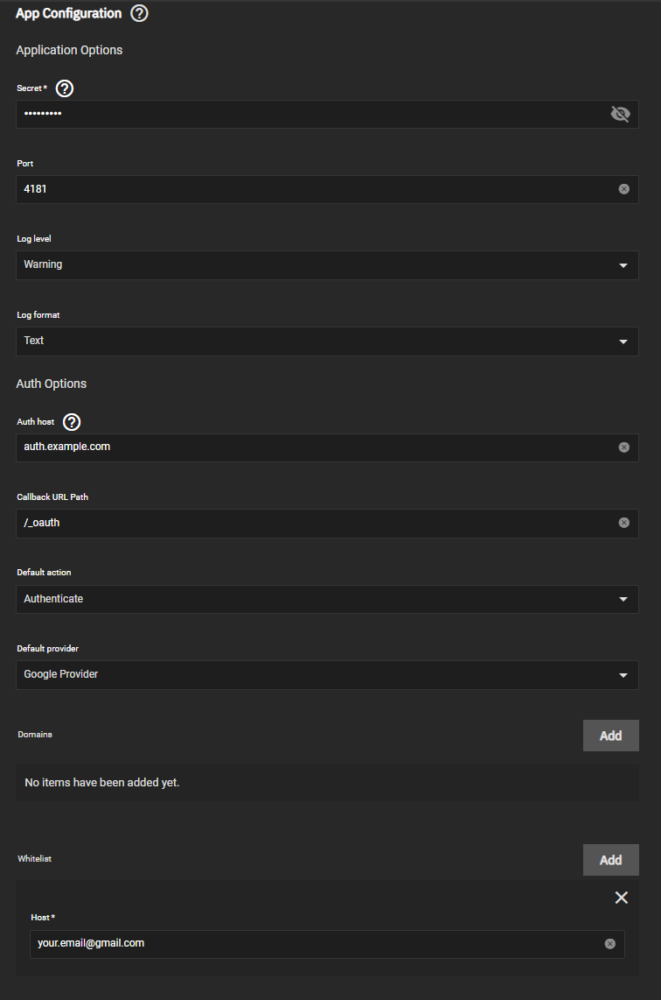
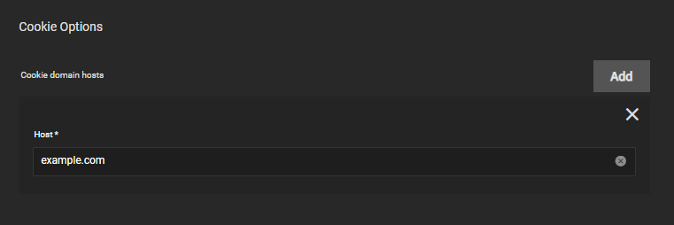
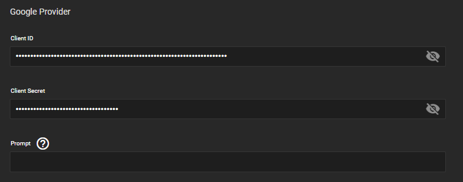
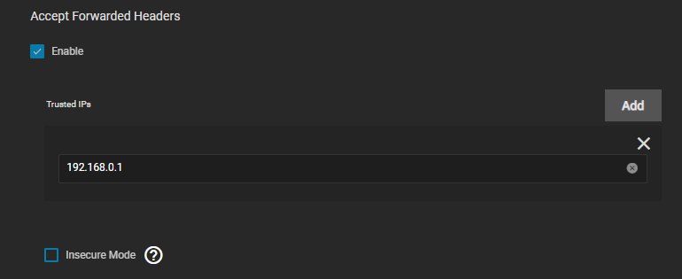
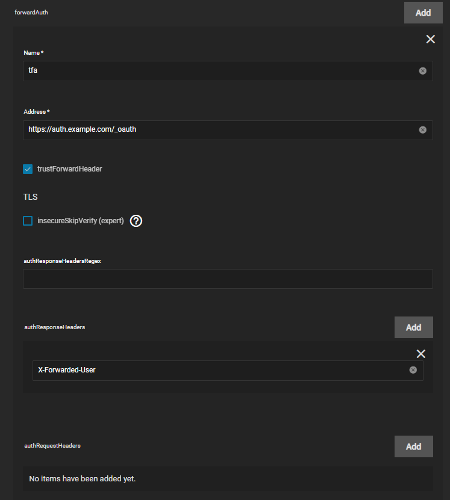

# traefik-forward-auth

This app makes it possible to have a layer of security in front of your publicly exposed apps.
It supports Google, OIDC, and generic OAuth2.
Please read the [GitHub README of the original project](https://github.com/thomseddon/traefik-forward-auth) for your
authentication options.

Note: generally, phone apps do not support redirection during their authentication flow, so this middleware is more suitable for
protecting portals that you would access through a browser.

## A standard setup (auth host mode)

This method will add a middleware to the traefik instance with Google authentication which then you can apply on any apps
with either subdomain or path prefix Ingress rules.
The example domain will be `https://example.com` which should be substituted to your externally accessible domain name.

### Setting up traefik-forward-auth

Assuming you have set up the `Client ID for Web application` in the developer console and set the `Authorized redirect URIs` to
`https://auth.example.com/_oauth`, start installing traefik-forward-auth:

- Set a `Secret` (it's mandatory, but can be any string of your choosing).
- Set `Auth host` to `auth.example.com`.
- Add your email to `Whitelist`.

  

- Add your root domain to `Cookie options`.

  

- Set the `Client ID` and `Client Secret` to the ones presented on the developer console. `Prompt` can be left empty.

  

- Set up Ingress for the app as `auth.example.com` as usual.
- That's it, since this is a stateless program, it doesn't need any special permissions or storage.

### Creating the middleware on traefik

The traefik instance has to be made aware of the forward authentication. Edit your traefik installation:

- Go to `websecure` entrypoint and enable `Accept forwarded headers`.
- Add your default gateway (internal router IP) to `Trusted IPs` if using hairpin NAT. If you are using DNS override for your
domain name, you can probably skip this step.

 

- Go to `Middlewares` and add a `forward-auth` one.
- Name it (use a short one if planning to add to many apps).
- Add `https://auth.example.com/_oauth` as address. This will redirect initial requests to the traefik-forward-auth container.
- Check `trustForwardHeader`.
- Add `X-Forwarded-User` to `authResponseHeaders`.

 

### Applying the middleware on apps

To actually use the forward authentication, you have to add it to either a chain or by itself to existing app Ingresses.

 

### Per-app whitelist

In case you need per-app whitelists, you have two options: set up multiple instances of traefik-forward-auth (cumbersome) or
use custom rules. Consult the readme of the original project how to set them.

### Testing

Opening your URL should result in being redirected to Google authentication. Subsequent checks if the auth is working can be
made by opening an incognito window.
