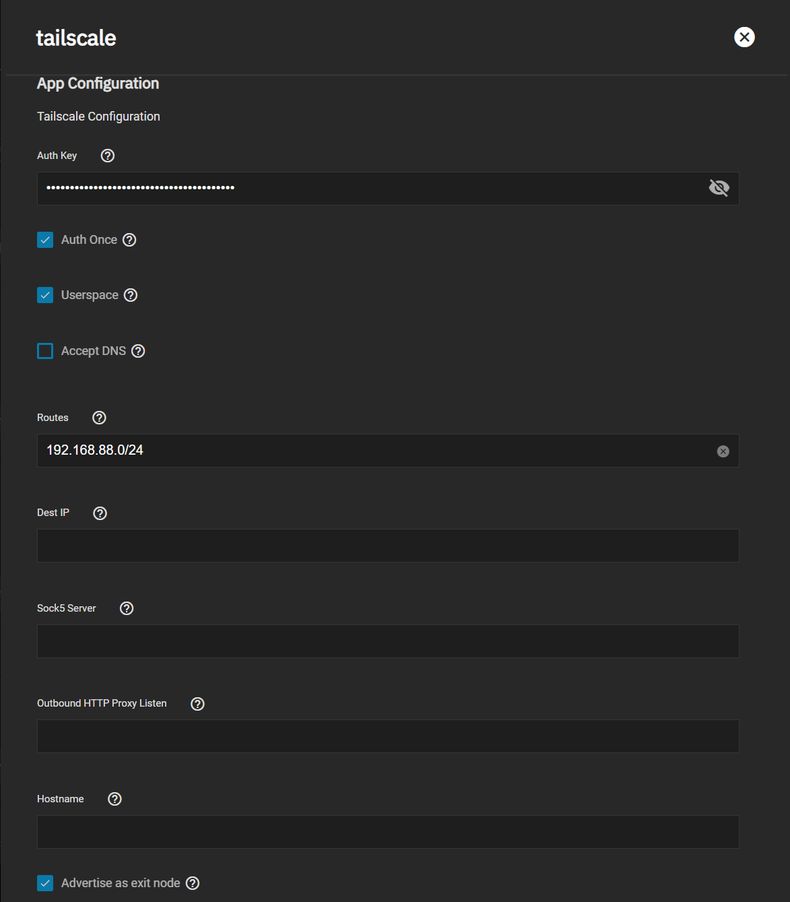
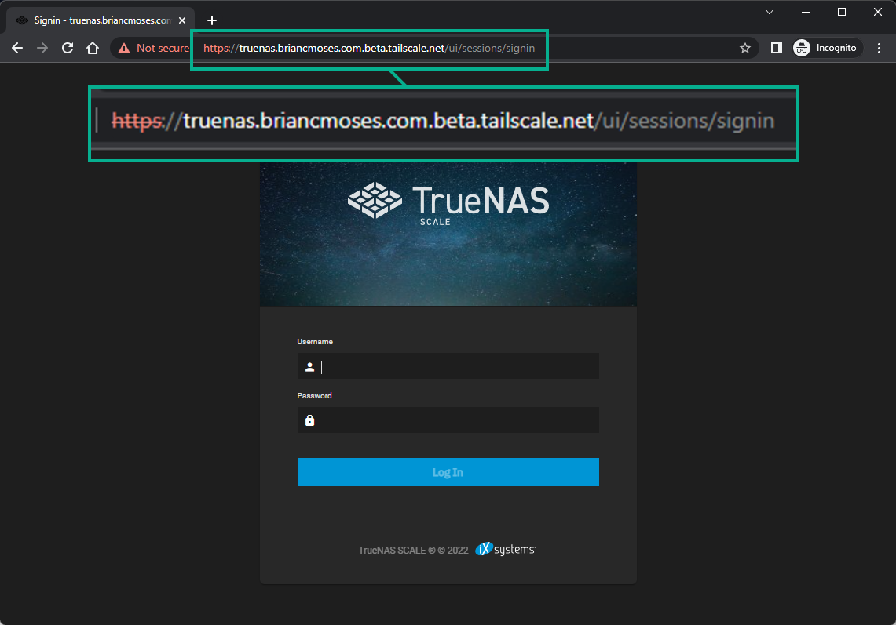
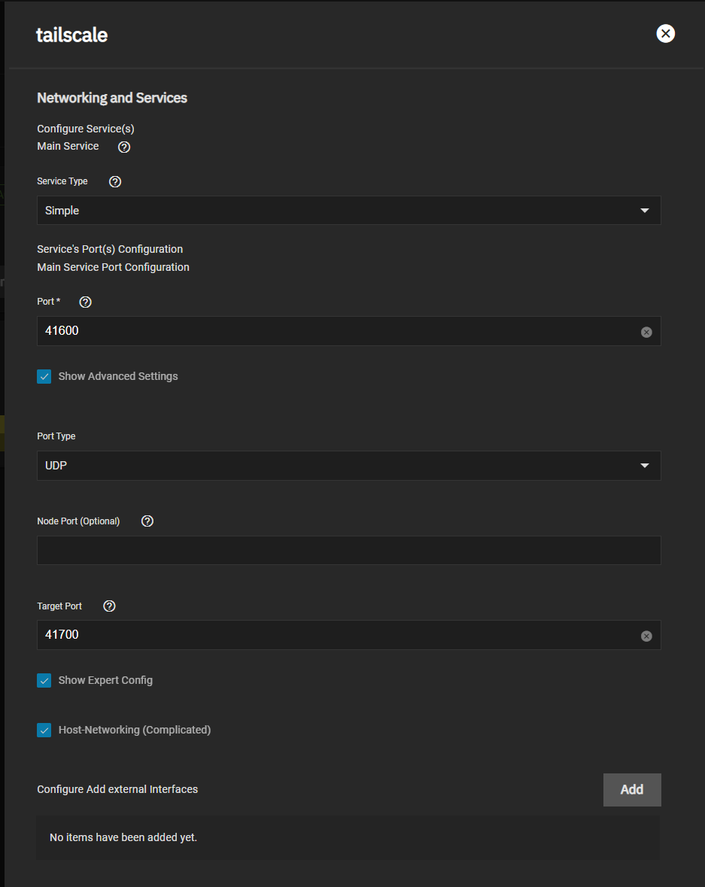

# How-To

This is a quick how-to or setup-guide to use Tailscale using on your TrueNAS box.
This can be applied to other systems but this specific guide is SCALE specific with the prerequisites.

## Requirements

- Tailscale Account (Free accounts available at [Tailscale's Official website](https://www.tailscale.com))
- Tailscale Truecharts Chart

## Prerequisites (LAN access only)

For proper access to your local network (LAN), this chart requires two `sysctl` values set on your TrueNAS or system.
For TrueNAS SCALE the way to change these values are inside `System Settings` then `Advanced`.
On that screen you add the following two values:

- `net.ipv4.ip_forward`
- `net.ipv4.conf.all.src_valid_mark`

Set them to `1` and `Enabled`

Also prepare your Tailscale Auth Key for your setup, easy to generate on the page below

## Tailscale Chart Setup

### Application name

Ideally use `tailscale` but you can use any name here.

### Controller

Leave defaults here.

### Container Configuration

- `Auth Key`: The key you received from tailscale in prerequisites above
- `Userspace`: Keep checked (default) unless you wish to create your own tunnels.
- `Accept DNS`: Enabling it will pass your Global Nameservers from Tailscale to your local install.
- `Routes`: Change to the routes you wish Tailscale to have access to on the devices it's connected, such as my LAN in the example.
- `Extra Args` passes arguments/flags to the `tailscale up` command.
- `Hostname` You can specify a specific hostname for use inside Tailscale (see image below). (Passes `--hostname HOSTNAME` to `extra_args`)
- `Advertise as exit node` This is used to pass traffic through tailscale like a private VPN. (Passes `--advertise-exit-node` to `extra_args`)

For more Extra Args and their usage please check the [Tailscale Knowledge Base](https://tailscale.com/kb/1080/cli/#up)
since we consider these advanced features and these may/not be compatible with everyone's exact setup.

TODO: Update image with the new fields

**Hostname example**

### Networking and Services

The default ports are fine for this chart, you shouldn't need to port forward or open ports on your router.

:::caution

In case you want to access their SMB shares or TrueNAS GUI via Tailscale.
You will have to ensure that `Host Networking` is enabled and `Userspace` is disabled.

:::

### Storage and Persistence

Highly recommended to leave it as `PVC (Simple)`

### Ingress

Shouldn't need to enable this.

### Security and Permissions

Should be left as is, unless you know what you are doing!

### Resources and Devices

You can set custom resources for CPU/RAM, but defaults should be work fine in most cases
Defaults are 4 vCores and 8G RAM.

### Addons

Shouldn't need to enable any.

## Support

- You can also reach us using [Discord](https://discord.gg/tVsPTHWTtr) for real-time feedback and support
- If you found a bug in our chart, open a Github [issue](https://github.com/truecharts/apps/issues/new/choose)

---

All Rights Reserved - The TrueCharts Project
