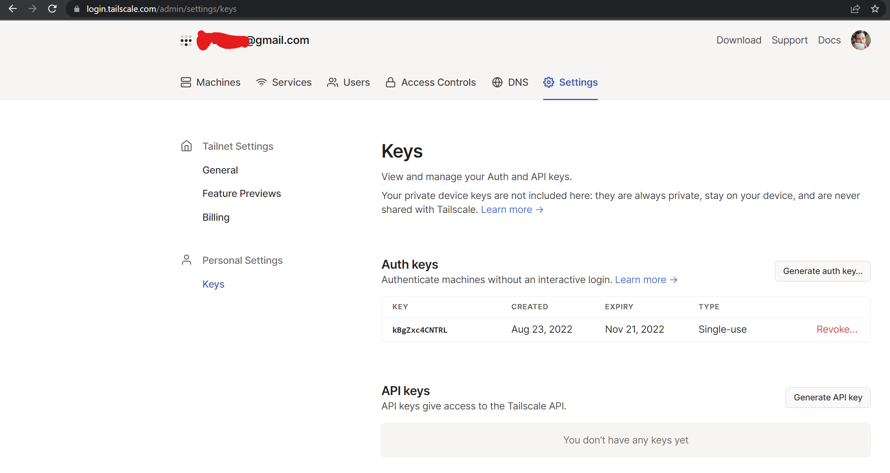

# How-To

This is a quick how-to or setup-guide to use Tailscale using on your TrueNAS box.
This can be applied to other systems but this specific guide is SCALE specific with the prerequisites.

## Requirements

- Tailscale Account (Free accounts available at https://www.tailscale.com)
- Tailscale Truecharts Chart

## Prerequisites

For proper access to your local network (LAN), this chart requires two `sysctl` values set on your TrueNAS or system. For TrueNAS SCALE the way to change these values are inside `System` then `Advanced`. On that screen you add the following two values:

- `net.ipv4.ip_forward`
- `net.ipv4.conf.all.src_valid_mark`

Set them to `1` and `Enabled`

Also prepare your Tailscale Auth Key for your setup, easy to generate on the page below

## Tailscale Chart Setup

Step 1-2: Ideally use `tailscale` but you can use any name here and leave defaults for Step 2

Step 3:

- Enter `Auth Key` you received from tailscale in prerequistes above
- Keep `Userspace` checked (default) unless you wish to create your own Wireguard tunnels,
- The default for `Accept DNS` is unchecked but enabling it will pass your Global Nameservers from Tailscale to your local install
- Change `Routes` to the routes you wish Tailscale to have access to on the devices it's connected, such as my LAN in the example
- Extra Args passes `UP_ARGS` from the `tailscale up` command to the chart. The most common one is `--advertise-exit-node` to pass traffic through tailscale like a private VPN. For more Extra Arghs please check the[Tailscale Knowledge Base](https://tailscale.com/kb/1080/cli/#up)

Step 4:

- The default ports are fine for this chart, you shouldn't need to port forward or open ports on your router. However many people will want to access their SMB shares or TrueNAS GUI via Tailscale. In order to do so you will have to ensure the screen is setup as below.

Steps 5-9: Adjust as necessary but defaults are fine.

## Support

- If you need more details or have a more custom setup the documentation on the [upstream](https://github.com/weejewel/wg-easy) is very complete so check the descriptions of the options there.
- You can also reach us using [Discord](https://discord.gg/tVsPTHWTtr) for real-time feedback and support
- If you found a bug in our chart, open a Github [issue](https://github.com/truecharts/apps/issues/new/choose)

---

All Rights Reserved - The TrueCharts Project
